# 🍯 Nectar - Mobile Recipes App

Nectar is my first mobile application built with **React Native**.  
The app fetches food recipes from the **DummyJSON API**, allowing users to browse and view details of different dishes.

---

## ✨ Features
- Browse a list of food recipes 🍲
- View detailed information for each dish 👨‍🍳
- Simple and clean mobile UI
- Built with React Native and integrated with an external API

---

## 🚀 Technologies Used
- React Native ⚛️
- DummyJSON API 🌐
- Expo / EAS Build for generating APK 📱

---

## 📥 Download
👉 [Download APK](https://expo.dev/accounts/amr_maher/projects/Nectar/builds/f704620a-2947-44f8-999d-044b74273308)

---

## 🖼️ Screenshots

### 📌Profile Screen
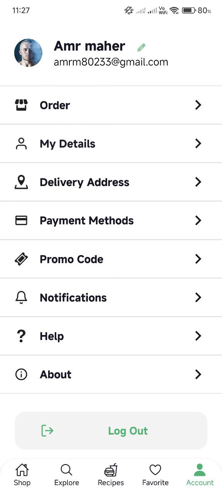
### 📌 Favorite List Screen
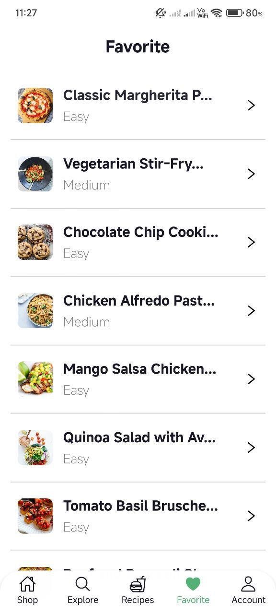
### 📌 Search List Screen
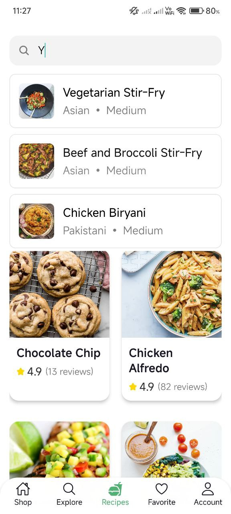
### 📌 Recipes List Screen
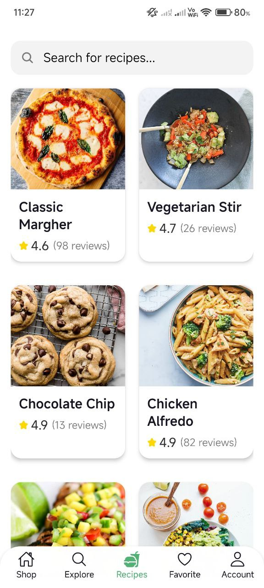
### 📌 Home Screen
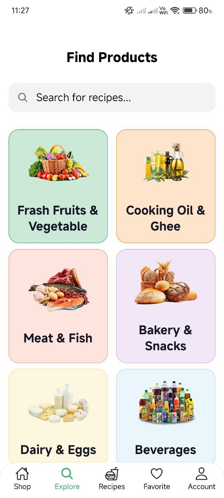
### 📌 Category List Screen

### 📌 Home List Screen

### 📌 Login  Screen
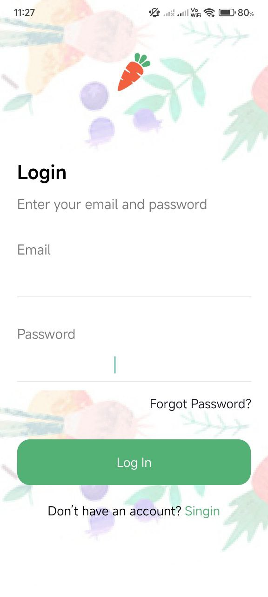
### 📌 Location Screen
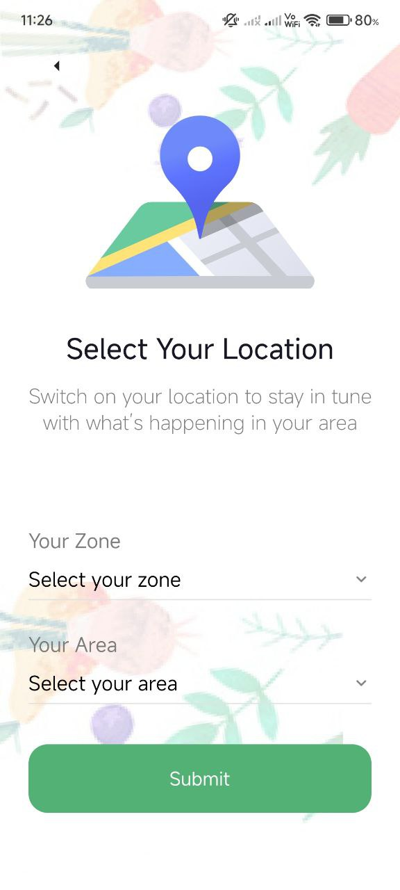
### 📌 Code Screen
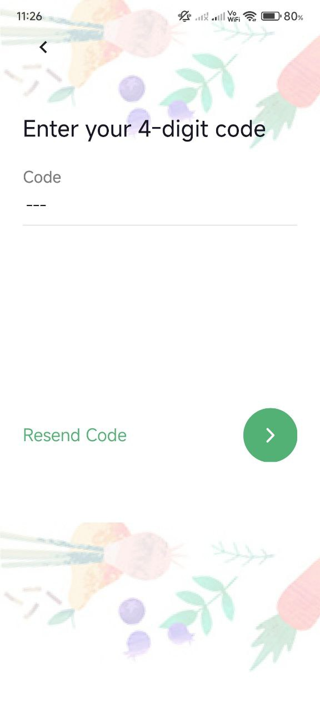
### 📌 Mobile number Screen
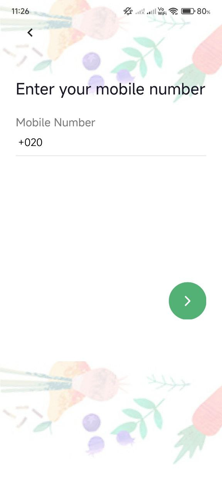
### 📌 Main Screen
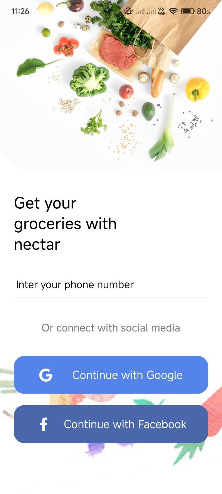
### 📌 Splash Screen

### 📌 Splash Screen
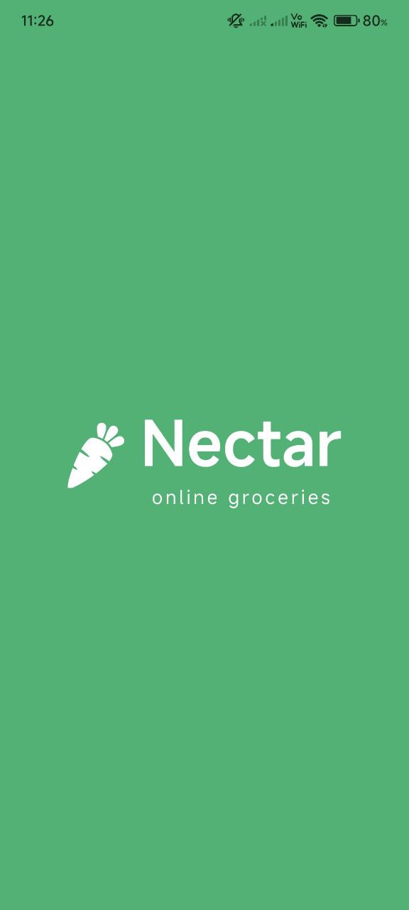

---

## 🛠️ How to Run Locally
```bash
# Clone the repository
git clone https://github.com/your-username/nectar.git

# Navigate into the project
cd nectar

# Install dependencies
npm install

# Start the development server
npx expo start
